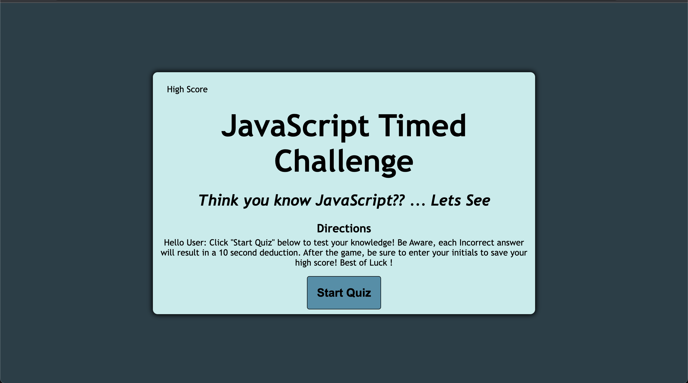

#### Timed-JavaScript-Quiz

### By _**{Miles Fonua}**_

CONTENTS OF THIS FILE
---------------------

 * Introduction
 * Deployment
 * Technology Used
 * Installation
 * Known Bugs/ Creator Content

 ### Introduction
 The Timed JavaScript Quiz is a timed quiz that challenges the user based of their knowledge of JavaScript (Quiz Based of w3 Schools). To start this quiz the User must click on the "Start Quiz" button. The User will then go through a series of multiple choice questions, Each incorrect answer will result in 10 seconds be deducted from the timer. 

 Once the user runs out of time or finishes the quiz, the timer will stop. The user will either have a choice to enter their initials in the HighScore, or Play again. If opted to play again the quiz will loop back to the beginnig for the user to try again.

 ### Deployment

 https://mffonua.github.io/Timed-JavaScript-Quiz/

 

## Technologies Used

* _My apple-mac laptop_
~Website Resources~
* W3 Schools
* Lots of Google
* Lots of Youtube

## Installation

 * To install the user must have access to the Internet; Once connected to the internet the user must enter 
 in the url https://mffonua.github.io/Timed-JavaScript-Quiz . After clicking enter the user is then led to the JavaScript Timed quiz and is able to use the website.

 ## Known Bugs & Creator Notes:

 * This quiz was a complete pain and I have spent countless nights as well as many resets of this web application.
 The final app you see is a result of 3 complete resets and many trial and errors.
 * Known Bugs : NONE 

